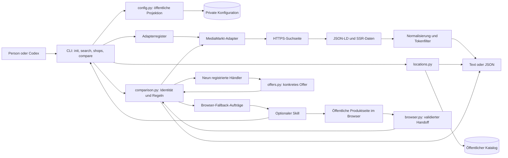
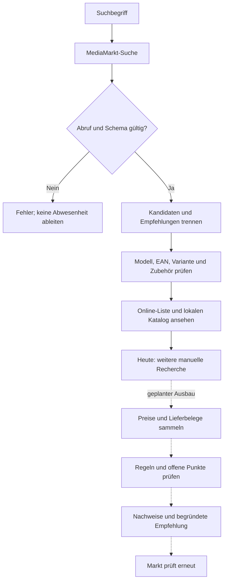
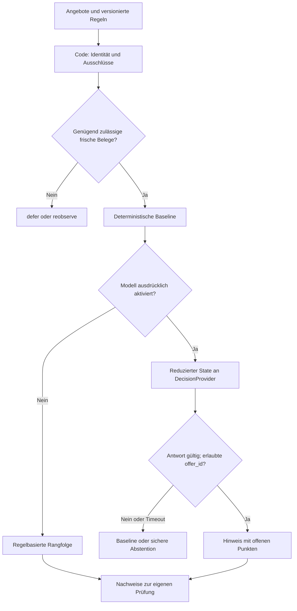

# pricecheck

Eine lokale Open-Source-CLI zur MediaMarkt-Produktsuche und zur Vorbereitung eines nachvollziehbaren Preisvergleichs. Python 3.11+, MIT-lizenziert, ohne zusätzliche Laufzeitabhängigkeiten. Ein optionaler Codex-Skill verbindet die CLI mit dem Gespräch.

**Status: frühe Version 0.1.1.** Suche und Händlerkatalog funktionieren; Konkurrenzpreise werden mit sichtbarer Teilabdeckung geprüft. Bestand im gewählten Markt und Anerkennung des Preisversprechens bleiben manuell zu prüfen. Das öffentliche Repository ist [price-promise-check](https://github.com/rieckt/price-promise-check); ein PyPI-Paket ist nicht veröffentlicht. Der Paketname in den Metadaten ist keine Aussage über seine Verfügbarkeit auf PyPI. Das Projekt ist unabhängig von MediaMarkt, Saturn und den genannten Händlern.

## Inhalt

- [Funktionen und Grenzen](#funktionen-und-grenzen)
- [Installation](#installation)
- [Einrichtung](#einrichtung)
- [Benutzung und Datenformat](#benutzung-und-datenformat)
- [Preisversprechen und Nachweise](#preisversprechen-und-nachweise)
- [Datenschutz und Veröffentlichung](#datenschutz-und-veröffentlichung)
- [Architektur](#architektur)
- [Code und Wartbarkeit](#code-und-wartbarkeit)
- [Produkt und Nutzerfluss](#produkt-und-nutzerfluss)
- [Analyse und nächste Schritte](#analyse-und-nächste-schritte)
- [Optionale Entscheidungshilfe mit Jev](#optionale-entscheidungshilfe-mit-jev)
- [Entwicklung und Tests](#entwicklung-und-tests)
- [Lizenz und Datenquellen](#lizenz-und-datenquellen)

## Funktionen und Grenzen

| Fähigkeit | Stand |
| --- | --- |
| MediaMarkt über Suchbegriffe suchen | Implementiert, erste öffentliche Ergebnisseite |
| Modellvarianten, EAN und Artikelnummer anzeigen | Implementiert, sofern die Seite Daten liefert |
| Direktverkauf und Marketplace unterscheiden | Implementiert; fehlende Belege bleiben `unknown` |
| Preis, Versand und Aktionspreise getrennt ausgeben | Implementiert; Aktionsbedingungen ungeprüft |
| Onlineverfügbarkeit anzeigen | Implementiert; kein Beweis für Bestand im Markt |
| Zulässige Online-Vergleichshändler auflisten | Implementiert, datierter Regelstand |
| Lokale Kandidaten und Luftlinienentfernung | Kuratierter Katalog für Markt 475, nicht vollständig |
| Anderen Markt konfigurieren | Implementiert; ohne passenden Katalog keine lokalen Kandidaten |
| Produkt per Link oder EAN exakt auflösen | Implementiert; mehrdeutige EAN erfordert Linkauswahl |
| Konkurrenzpreise und Lieferzeiten abrufen | Neun Händler im Register; acht Produkt-URL-Routen, HTTP/Browser mit sichtbaren Datenlücken |
| Preisversprechen automatisch beurteilen | Harte Ausschlüsse und offene Prüfungen; keine Anerkennungszusage |
| Nachweise und Prüfreihenfolge | Quellen, UTC-Zeit und regelbasierte Rangfolge im JSON; kein Exportpaket |
| Jev oder anderes Entscheidungsmodell | Entwurf, kein ausführbarer Modus |

Alle wörtlichen Suchbegriffe müssen im Produktnamen, der EAN oder Artikelnummer vorkommen, damit ein Ergebnis in `products` erscheint. Weitere Empfehlungen stehen in `suggestions`. Das verhindert einige falsche Treffer, kann aber Schreibvarianten übersehen. Auch Zubehör kann alle Begriffe enthalten. Ein Kandidat bleibt deshalb `identity_match: unverified`.

## Installation

### Voraussetzungen

- Python 3.11 oder neuer und `pip`.
- Netzwerkzugang für Live-Suche und gegebenenfalls Installation von Build-Werkzeugen.
- Git nur zum Klonen und zur Prüfung des öffentlichen Quellbaums.
- Kein MediaMarkt-Login, Browserprofil, API-Schlüssel oder KI-Abonnement erforderlich.

Repository klonen oder als Quellarchiv herunterladen und in dessen Stammverzeichnis wechseln. Das Projekt wird auf GitHub veröffentlicht; eine gleichnamige PyPI-Veröffentlichung ist nicht automatisch dieses Projekt.

```sh
git clone https://github.com/rieckt/price-promise-check.git
cd price-promise-check
```

### macOS und Linux

```sh
python3 -m venv .venv
. .venv/bin/activate
python -m pip install .
pricecheck --help
```

`python3 --version` muss mindestens 3.11 anzeigen. Für spätere Aufrufe die Umgebung erneut aktivieren oder `.venv/bin/pricecheck` verwenden. `python -m pricecheck_app` ist eine gleichwertige Einstiegsmöglichkeit. Der Launcher `./pricecheck` funktioniert direkt aus dem Checkout.

### Windows, PowerShell

```powershell
py -3.11 -m venv .venv
.\.venv\Scripts\python.exe -m pip install .
.\.venv\Scripts\pricecheck.exe --help
```

Windows ist hier als Einrichtung beschrieben, wurde in dieser Arbeitsumgebung jedoch nicht praktisch verifiziert. Dateirechte dort müssen über NTFS-Zugriffsrechte geprüft werden.

### Optional: Codex-Skill

Zuerst sicherstellen, dass `pricecheck --help` in der Umgebung des Agenten funktioniert. Dann den Ordner `skill` als `pricecheck` in das eigene Skill-Verzeichnis kopieren, standardmäßig `~/.codex/skills/pricecheck`. Eine neue Codex-Sitzung lädt die aktualisierte Skill-Liste. Der Skill enthält keine persönlichen Pfade, Zugangsdaten oder feste Nutzeradresse.

## Einrichtung

**Die Produktsuche braucht keine Konfiguration.** Ein frischer Checkout hat keinen vorausgewählten Markt. `shops` kann bereits die Online-Liste anzeigen.

Für den mitgelieferten öffentlichen Beispielkatalog:

```sh
pricecheck init --market-id 475
pricecheck shops
```

Markt 475 ist der [MediaMarkt Lübeck am CITTI-PARK](https://www.mediamarkt.de/de/store/luebeck-475). Beispiele benennen einen öffentlichen Geschäftsstandort, keine Wohnadresse. Für einen anderen Markt dessen ID aus der offiziellen Marktseite übernehmen:

```sh
pricecheck init --market-id 123 --market-name "Mein gewählter MediaMarkt"
```

`123` ist ein Platzhalter. `--market-address`, `--latitude` und `--longitude` können öffentliche Marktdaten ergänzen. Koordinaten brauchen beide Werte in der Reihenfolge Breitengrad, Längengrad. Dadurch entsteht noch kein Händlerkatalog und es wird kein Marktbestand abgefragt.

Konfigurationspfad: `$XDG_CONFIG_HOME/pricecheck/config.json`, falls `XDG_CONFIG_HOME` gesetzt ist, sonst `~/.config/pricecheck/config.json`. Er liegt außerhalb des Checkouts. `init` erzeugt unter POSIX eine Datei mit Modus `0600` und einen neuen Konfigurationsordner mit `0700`; vorhandene Ordner werden nicht umgestellt. Bestehende Dateien werden niemals überschrieben.

```json
{
  "schema_version": 1,
  "market_id": "475"
}
```

Bei einem Wechsel den vorhandenen lokalen Datensatz manuell bearbeiten. Ältere Einstellungen mit `schema_version: 1`, `market_id` und optionalem `home_address` bleiben kompatibel. Die Ladefunktion gibt nur öffentliche Marktfelder an CLI und Katalog zurück. Eine Wohnadresse wird derzeit weder benötigt noch für Lieferzeiten verwendet. Falls sie für einen späteren Liefercheck lokal ergänzt wird, gehört sie ausschließlich in `home_address`, niemals in öffentliche Marktfelder oder einen Suchbegriff.

## Benutzung und Datenformat

```sh
pricecheck search "dreame r20"
pricecheck search "dreame r20 pro" --limit 5 --json
pricecheck search "miele guard" --retailer mediamarkt --json
pricecheck shops --json
pricecheck compare "https://www.mediamarkt.de/de/product/_miele-guard-m1s8380-bodenstaubsauger-maximale-leistung-890-watt-2966535.html" --json
pricecheck compare "4002516847533" --json
```

| Befehl / Option | Verhalten |
| --- | --- |
| `search QUERY` | Ruft eine öffentliche Suchseite ab |
| `--retailer mediamarkt` | Wählt den Suchadapter; Vergleichshändler steuert `compare` |
| `--limit N` | Begrenzt Kandidaten und separat Vorschläge, jeweils 1 bis 100 |
| `--json` | Strukturierte Ausgabe für Agenten und Skripte |
| `shops` | Liest den lokalen, datierten Katalog ohne Netzwerkabruf |
| `compare URL_OR_EAN` | Löst das konkrete Produkt auf und prüft die neun Händler über Such-/Fallback-Routen |
| `compare ... --offer-url URL` | Prüft eine konkrete Alternate-/Galaxus-Produktseite; wiederholbar, maximal zwölf URLs |
| `compare ... --browser-evidence FILE` | Importiert frische Browserbelege; `-` liest stdin, wiederholbar |
| `init --market-id ID` | Erstellt lokale Einstellungen ohne Überschreiben |

`--limit` lädt keine weiteren Seiten. Aktionspreise stehen getrennt im JSON und werden im Textmodus nicht zusätzlich dargestellt. Alle Unterbefehle haben `--help`.

### Ergebnisvertrag

- `schema_version: 1` versioniert das Ausgabeformat.
- `status: ok` bedeutet erfolgreicher Abruf und Parsing, keine Angebotsanerkennung.
- `source`, `observed_at` und `scope: first_search_page` benennen Herkunft, UTC-Abrufzeit und Reichweite.
- `parsed_count` zählt normalisierte Seiteneinträge; `matched_count` Kandidaten vor dem Ausgabelimit; `returned_count` ausgegebene Kandidaten.
- `products` und `suggestions` dürfen nicht als exakte Produktübereinstimmung interpretiert werden.
- Preise sind Dezimalstrings wie `"263.79"`; fehlende Zahlen sind `null`. Versand bleibt getrennt.
- `promotions` enthält öffentliche und Mitgliederpreise mit `eligibility: not_checked`.
- `seller_kind`: `direct`, `marketplace` oder `unknown`; der Verkäufername allein ist kein Beweis.
- `online_availability`: `available`, `unavailable` oder `unknown`. `market_availability` bleibt `unknown`.
- `condition` in Suchtreffern bleibt unbekannt, außer eine Zustandsangabe stimmt mit der aktiven Angebots-ID überein. Ein alternatives Gebrauchtangebot verändert den aktiven Zustand nicht.
- `price_promise` in Suchtreffern ist weiterhin `not_checked`; `compare` liefert separate Bewertungen.

Exit 0 bezeichnet einen erfolgreichen Befehl, auch bei leerer Kandidatenliste. Laufzeitfehler liefern Exit 1 und bei `--json` einen Fehlerdatensatz. Ungültige Kommandozeilensyntax meldet `argparse` mit Exit 2 und Text auf stderr, auch wenn `--json` angegeben ist.

### Vergleichsvertrag

`compare` funktioniert kategorienübergreifend mit Händleradaptern, ohne Code pro Artikel. Zuerst `search` zur Auswahl verwenden, anschließend eine konkrete MediaMarkt-URL übergeben. Eine EAN wird nur bei genau einem Treffer übernommen und auf der Produktseite erneut geprüft. GTIN-Prüfziffern werden validiert und Codes auf 14 Stellen normalisiert. Fehlende oder widersprüchliche Identität beendet den Vergleich. Gleiche GTIN ist ein starkes Identitätsmerkmal; Bundles und Sonderbedingungen bleiben zusätzlich zu prüfen.

`product.offers` enthält die Angebote der gewählten MediaMarkt-Seite. Preis, Verkäufer und Zustand stammen jeweils aus demselben JSON-LD-`Offer`, niemals aus einem benachbarten Angebot. `offers` enthält Wettbewerbsangebote und `assessment` mit `identity_match`, `excluded_reasons` und `review_reasons`. Marketplace, andere GTIN, gebrauchte/generalüberholte Artikel, Apple und nachgewiesene Mindestlieferzeiten über drei Tagen führen zu `excluded`. Alle übrigen Angebote bleiben `needs_review`.

`delivery` gibt nur das allgemeine Deutschland-Lieferfenster aus Händler-Metadaten wieder. Es bestätigt weder die konkrete Lieferadresse noch Kalendertage, Bestellschluss oder Versand am Wochenende. Daher ist die Drei-Tage-Bedingung weiterhin manuell zu prüfen. Versandkosten werden getrennt dargestellt und beeinflussen die Rangfolge nicht, da sie laut Preisversprechen ausgeschlossen sind. Der MediaMarkt-Onlinepreis ist kein belegter Preis im gewählten Markt; der Differenzbetrag wird deshalb nicht berechnet.

`retailer_checks` zeigt alle neun zugelassenen Onlinehändler. Alle neun haben Such-/Fallback-Routen. Acht unterstützen kanonische Produkt-URLs und den strengen JSON-LD-Import. Joybuy besitzt noch kein verifiziertes Produktschema und meldet einen manuellen Rechercheauftrag. notebooksbilliger benötigt aktuell eine manuelle Produktsuche. Diese Registrierung bestätigt keine erfolgreiche Preisabdeckung. Abrufblockaden melden `blocked`, sonstige Fehler `failed`; einzelne fehlgeschlagene Produktseiten ergeben `partial`. `no_search_results` bedeutet nur eine explizit leere erste Suchseite. `checked` bestätigt das Parsing, keine Anerkennung. `coverage: partial` und `local_offer_checks: not_supplied` bleiben sichtbar. Exit 0 bei `compare` bestätigt den Ergebnisbericht, selbst wenn alle Wettbewerbsquellen fehlen; Agenten müssen deshalb die Einzelstatus prüfen.

`review_first` nennt einen nicht ausgeschlossenen Kandidaten, zuerst nach Anzahl offener Prüfungen, dann nach Artikelpreis. Das ist eine Prüfreihenfolge ohne Annahmewahrscheinlichkeit. Marktbestand/-preis, Mitgliedschaft, Bundles, Aktionen und weitere Ausschlüsse bleiben offen. Kein Modellaufruf ist erforderlich.

**Live-Beobachtung am 02.10.2026:** Alternate war per HTTP erreichbar; die R20-EAN-Suche meldete ausdrücklich keine Ergebnisse. Galaxus lieferte der CLI HTTP 403, obwohl die Produktseite im Browser erreichbar war. Die CLI meldet einen Browser-Fallback-Auftrag und ersetzt blockierte Quellen nicht unbemerkt durch Suchmaschinenpreise. Der Browser-Handoff wurde anschließend mit dem R20 erfolgreich bis zum CLI-Bericht geprüft; Verkäufer und Liefertermin blieben offen. Ein konkreter `--offer-url` hilft bei uneindeutiger Suche, garantiert aber keinen Zugriff auf blockierte Seiten.

### Browser-Fallback mit Codex

Der Ablauf ist **CLI → Browser-Auftrag → Codex-Browser → validierter CLI-Import**. `fallback_requests` nennt Händler, EAN, Suchlink, gegebenenfalls Produktlinks und Fehlerstatus. Mit dem installierten Skill setzt Codex die unterstützten Aufträge im selben Task fort. Ohne Agent liefert die CLI die Aufträge zur eigenen Bearbeitung; sie startet keinen KI-Dienst und benötigt keinen zusätzlichen Modellschlüssel.

Auf der frisch geöffneten kanonischen Produktseite wird [`capture-product.js`](skill/references/capture-product.js) mit einem Browserwerkzeug ausgewertet. Es übernimmt nur ausgewählte Produkt-/Angebotsfelder aus JSON-LD, keine Beschreibungen, Rezensionen, HTML oder Browserprofile. Suchergebnisse allein sind keine Preisbelege. Fehlendes JSON-LD oder eine blockierte Browserseite bleibt ungeklärt.

```sh
pricecheck compare "MEDIA_MARKT_PRODUCT_URL" --json
pricecheck compare "MEDIA_MARKT_PRODUCT_URL" --browser-evidence /private/path/evidence.json --json
# Alternativ: das JSON über stdin übergeben, ohne untrusted Daten als Shellcode einzusetzen.
pricecheck compare "MEDIA_MARKT_PRODUCT_URL" --browser-evidence - --json < /private/path/evidence.json
```

Der Importvertrag ist `{"schema_version": 1, "captures": [{"source": "CANONICAL_PRODUCT_URL", "observed_at": "ISO_TIMESTAMP_WITH_TIMEZONE", "product": {"@type": "Product", "name": "…", "gtin": "…", "offers": []}}]}`. Das ist eine Schemaillustration; der tatsächliche Beleg braucht eine gültige GTIN und mindestens ein konkretes Angebot. Den vollständigen Datensatz erzeugt das Capture-Skript. Maximal zwölf Belege insgesamt, 128 KB je Eingabedatei, höchstens 15 Minuten alt und maximal 60 Sekunden in der Zukunft. Quellen sind auf die kanonischen Produktpfade der unterstützten Händler beschränkt; Joybuy besitzt noch keinen verifizierten Produktpfad. Doppelte Quellen/JSON-Schlüssel, unbekannte Envelope-/Produktfelder und fehlende Identität werden abgewiesen.

Produktgebundene JSON-LD-Kennungen über `@id`, Typ-Arrays, `mainEntity` und relative Angebotslinks werden unterstützt. Andere Hosts und abweichende Produktpfade bleiben ausgeschlossen. Galaxus veröffentlicht bei manchen UPC-A-Produkten die generische `gtin` ohne führende Null. Ausschließlich eine elfstellige Zeichenfolge in diesem Galaxus-Feld wird um eine Null ergänzt und anschließend auf gültige Länge und Prüfziffer geprüft. `published_gtin` und `gtin_normalization: galaxus_leading_zero_restored` kennzeichnen diesen Fall im Angebot. Die allgemeine GTIN-Eingabe bleibt strikt; fehlende Kennungen werden nicht aus Produktnamen oder Artikelnummern abgeleitet.

`browser_checked` bestätigt einen validierten Import. `evidence: browser_jsonld`, Angebots-`observed_at`, `evidence_sha256` und `capture_trust: user_or_agent_supplied_not_authenticated` kennzeichnen die Herkunft. Der Hash identifiziert den importierten Inhalt; er beweist nicht, dass der Händler ihn veröffentlicht hat. Auch KI kann falsche Daten liefern: GTIN, Quellenbindung, Format und Frische werden geprüft, fehlende Verkäufer-/Liefernachweise bleiben offen. Browserimporte ersetzen für diesen Händler die HTTP-Suche, nicht die Prüfung anderer Händler. Bei zusätzlichen `--offer-url` müssen die Quellen übereinstimmen.

Temporäre Belege nur außerhalb des Repositorys in privaten Verzeichnissen (0700) und Dateien (0600) halten oder direkt per stdin verarbeiten. Die CLI speichert Belege nicht selbst. Keine Wohnadressen, Cookies oder Kontodaten erfassen. `observed_at` bezeichnet die Beobachtung, nicht eine vom Händler garantierte Aktualisierung. Alte Belege erneut im Browser erfassen; Zeitstempel niemals nachträglich auffrischen.

### Sichtbare Verkäufer- und Lieferbelege

Ein Browser-Capture darf optional `observations` enthalten. Jeder Eintrag ist durch `offer_price` an genau ein Angebot auf derselben Produktseite gebunden:

```json
{"offer_price":"47.57","seller":{"name":"Galaxus","quote":"Supplied by Galaxus"},"delivery":{"latest_date":"2026-10-06","quote":"Delivered Tue, 6.10.","scope":"country_DE"}}
```

Das Beispiel beschreibt die öffentliche LEGO-Beobachtung vom 02.10.2026, keinen aktuellen Preis. Verkäufer und Lieferdatum dürfen jeweils `null` sein, aber nicht beide. Originalzeit und GTIN stammen aus dem Capture. Widersprüchliche Verkäufer, mehrere Angebote zum selben Preis und private Zusatzfelder werden abgelehnt. Eine sichtbare spätere Lieferung als drei Kalendertage führt zum Ausschluss; ein früheres allgemeines Datum bestätigt keine Lieferung zur Privatadresse. `visible_observation` und `advertised_delivery` machen die zusätzliche Herkunft sichtbar.

### Markt- und lokale Prospektbelege

`--review-evidence FILE` übernimmt separat frische, manuell erfasste öffentliche Belege. Die CLI ruft den Beleglink nicht ab und bestätigt seine Echtheit nicht. Selbst aufgenommene Fotos werden als lokale Preisnachweise abgelehnt. Beispielstruktur mit Platzhaltern:

```json
{
  "schema_version":1,
  "source":"SELECTED_MEDIAMARKT_PRODUCT_URL",
  "gtin":"EXACT_GTIN",
  "observed_at":"ORIGINAL_ISO_TIMESTAMP_WITH_TIMEZONE",
  "market":{"id":"475","pickup":"available_today","stock":"unknown","price":null,"evidence_kind":"selected_market_ui"},
  "local_offers":[{"shop":"EP:ElectronicPoint","gtin":"EXACT_GTIN","price":"199.00","currency":"EUR","valid_from":"2026-10-01","valid_until":"2026-10-03","evidence_kind":"flyer","source":"https://example.org/public-flyer.pdf"}]
}
```

`market` darf `null`, `local_offers` darf leer sein. Zulässige Abholwerte sind `available_today`, `unavailable`, `unknown`; Bestandswerte `confirmed_in_store`, `unavailable`, `unknown`. Eine ausgewählte Markt-UI belegt weder den physischen Preis noch durch Abholung den Regalbestand. Preis und bestätigter Bestand erfordern separat `in_store_display`. Solche Angaben bleiben selbst bereitgestellte Belege und erzeugen keine automatische Anerkennung oder Ersparnisberechnung.

Lokale Angebote benötigen eine genaue GTIN, einen Shop aus dem konfigurierten Katalog, EUR-Preis, aktuell gültigen Zeitraum und `flyer` oder `printed_advertisement`. Quellen müssen öffentliche HTTPS-URLs ohne Query/Fragment sein. Die Entfernung und Grenzfälle stammen aus dem Katalog; Echtheit, Bestand und Marktauslegung bleiben offen. Außerhalb des berechneten Radius liegende Angebote werden ausgeschlossen. Die CLI durchsucht keine lokalen Prospekte automatisch. Alle Belege verfallen nach 15 Minuten; Gültigkeitsdaten eines Prospekts ersetzen keine frische Beobachtung.

### Händlerzugänge und Live-Test

| Händler | Aktueller Zugang und bekannte Grenzen |
|---|---|
| Alternate | HTTP-EAN-Suche und konkrete Produktseite; explizite Leermeldung unterstützt |
| Galaxus | HTTP kann 403 liefern; Browserimport unterstützt deutsche und englische Seiten auf galaxus.de |
| Amazon | Suchroute und kanonische ASIN-URL; öffentliche Suche kann nur eine leere Shell liefern |
| OTTO | Suchroute und Produkt-URL; beobachtetes JSON-LD ohne GTIN/Verkäufer wird nicht exakt übernommen |
| Cyberport | Such-/Produktroute; HTTP-Blockaden erfordern Browserbelege |
| notebooksbilliger | Kanonische Produkt-URL; Suchschema offen, manuelle Suche erforderlich |
| Coolblue | Such-/Produktroute; HTTP-Blockaden und fehlende GTIN möglich |
| Expert | Such-/Produktroute; Nuxt-Metadaten allein ohne konkretes Angebot reichen nicht |
| Joybuy | Einstiegspunkt; HTTP-Fehlerseite und noch ungeprüftes Produkt-URL-Schema |

Die fünf zusätzlichen Live-Fälle am 02.10.2026 waren LEGO 10313, Logitech MX Master 3S Bluetooth Edition, Samsung 990 PRO 1 TB ohne Kühlkörper, Sony WF-1000XM5 schwarz und Philips HD9252/90. Vier lieferten exakt GTIN-gebundene Galaxus-Browserimporte. Alternate lieferte Angebote für LEGO und Samsung, für die gewählten Logitech-/Sony-Varianten explizit keine Suchtreffer. Philips war trotz Suchtreffer auf MediaMarkt mit HTTP 410 entfernt; die CLI meldet dafür `source_gone`, keine erfundene Vergleichsliste. Das ist kein Nachweis erfolgreicher Live-Abdeckung aller neun Händler.

Für LEGO war im ausgewählten Lübecker Markt Abholung am selben Tag sichtbar. Der öffentliche SSR-Preis war ein Onlinepreis, der SSR-Abholblock hatte keinen ausgewählten Markt. Auf Galaxus waren Verkäufer Galaxus und ein allgemeiner Liefertermin vier Kalendertage später sichtbar. Diese Einzelbeobachtungen belegen keinen Privatadress-Liefertermin oder physischen Ladenpreis.

Langfristige Zugänge: Amazons [Creators API](https://affiliate-program.amazon.com/creatorsapi/docs/) erfordert Teilnahme und Zugang; Coolblue beschreibt einen registrierungspflichtigen Feed im [Affiliate-Handbuch](https://www.coolblue.de/download/771f559af65ed5331a86fee5b6c8dc1e/Affiliate_manual_DE.pdf). Keine Zugangsdaten oder Feeds sind eingebunden. Die öffentlichen Schema-Beobachtungen stammen unter anderem aus [OTTO-Suche](https://www.otto.de/suche/samsung%20990%20pro/) und [Expert-Produktseite](https://www.expert.de/shop/unsere-produkte/computer-zubehor/speichermedien/interne-festplatten/17320012214-990-pro-nvmetm-m-2-ssd-2-tb.html).

### Langfristiger Datenzugang

Die Erweiterungseinheit ist ein Händler, nicht ein Produkt. URLs/GTIN identifizieren Artikel; der Händleradapter normalisiert Angebote aller unterstützten Kategorien. Änderungen am Seitenschema erfordern Wartung dieses Adapters. Fehlende GTIN bleiben ungeklärt, statt durch ähnliche Namen ersetzt zu werden.

Für Galaxus zeigt der Live-Test einen Unterschied zwischen HTTP und normalem Browserzugriff. Ein austauschbarer Transport kann langfristig dieselben Parser mit HTTP, einem optionalen lokalen Browser oder einer autorisierten Datenquelle versorgen. Ein Browser-Handoff ist implementiert: Codex navigiert, die CLI validiert die erfassten Produktdaten. Ein eigenständig laufender Browser in der CLI ist nicht enthalten; die Zuverlässigkeit unbeaufsichtigter Browserläufe bleibt unbelegt. CAPTCHA/Zugriffsblockaden führen zu einem sichtbaren Abbruch oder manueller Prüfung; Cookies/Browserprofile bleiben privat. Kein Browsermodul darf Wohnadressen an zusätzliche Dienste senden.

Galaxus nennt in seiner offiziellen [Affiliate-Seite](https://www.galaxus.de/de/page/werden-sie-affiliate-partner-17259) Tradedoubler und verfügbare Produktdaten/-filter (Seite vom 15.05.2023, geprüft am 02.10.2026). Das ist ein konkreter Zugangskandidat, keine bestätigte frei nutzbare Preis-/Liefer-API. Vor einer Feed-Anbindung sind Teilnahme, Nutzungsrechte, GTIN-Abdeckung, Verkäuferkennzeichnung, Aktualität und Lieferdaten zu prüfen. Die Händler-Integration importiert Verkäuferdaten in Galaxus und ersetzt keinen Käufer-Preisfeed. Anmeldung oder Kontaktaufnahme sind nicht erfolgt.

Für eine persönliche Installation ist der Skill-gesteuerte Browser-Handoff mit explizitem Fallback und identischem Angebotsvertrag vorhanden. Für einen gehosteten Dienst sind vereinbarte Feeds/Schnittstellen die bevorzugte Perspektive. Cache mit kurzer Gültigkeit, Quellenzeit je Angebot, Gesamtdeadline, Rate-Limits und datierte Schema-Fixtures müssen hinzukommen. Unvollständige Daten bleiben in allen Abrufwegen sichtbar; das Modell erhält nur bereits normalisierte Fakten.

### Händlerkatalog

`local_catalogue_status`: `available`, `not_configured` oder `not_available`. Fehlende Abdeckung bedeutet nicht, dass es keine Wettbewerber gibt.

Der Beispielkatalog enthält zehn öffentliche Standorte in und um Lübeck, darunter [EP:ElectronicPoint](https://www.ep.de/electronicpoint), [JessenLenz](https://jessenlenz.eu/kontakt/), [Electro Schweim](https://www.schweim.de/kontakt/) und Expert. Sortiment, Preis und Bestand sind nicht geprüft. Apple-Schwerpunkte sind markiert, da Apple-Produkte laut Regelstand ausgeschlossen sind.

`distance_km` ist gerundete Luftlinie vom MediaMarkt aus. Der Radiusvergleich verwendet den ungerundeten Wert. Weniger als ein Kilometer Abstand zur 30-km-Grenze ergibt `radius_assessment: borderline`. Straßenkoordinaten sind als ungenauer markiert. Diese Vorauswahl bestätigt keine Anerkennung.

## Preisversprechen und Nachweise

Regelstand des Katalogs: **2. Oktober 2026**. Vor einem Kauf die [vollständigen aktuellen Bedingungen](https://faq.mediamarkt.de/app/answers/detail/a_id/21238/kw/Preisgarantie/related/1) erneut öffnen.

Das Wettbewerber-Preisversprechen betrifft laut FAQ Käufe im Markt mit myMediaMarkt-/mySaturn-Mitgliedschaft und ein identisches, im Markt vorrätiges Produkt. Gelistete Onlinehändler sind JoyBuy, Amazon, Otto, Cyberport, Alternate, notebooksbilliger, Coolblue, Expert und Galaxus. Marketplace-Angebote zählen nicht; Onlineangebote müssen sofort verfügbar und innerhalb von drei Tagen lieferbar sein.

Daneben nennt MediaMarkt stationäre Wettbewerber im Umkreis von 30 km um den Markt. Ein physischer Preisnachweis ist nötig, etwa Flyer oder Werbeanzeige; selbst angefertigte Lichtbilder werden nicht akzeptiert. Die FAQ definiert die Entfernungsmessung nicht; Luftlinie ist hier eine technische Vorauswahl.

Es gibt weitere Ausschlüsse, darunter Apple, gebrauchte/generalüberholte Ware, Bundles und bestimmte Rabattaktionen. Die vollständigen Bedingungen sind maßgeblich. Dieser Wettbewerbspreisvergleich ist von den separat beschriebenen Regeln für Onlinebestellungen oder nachträgliche Preissenkungen zu unterscheiden.

Ein künftiges Nachweispaket soll genaue Produktidentität, Anbieter/Verkäufer, Preis, Versand, Zustand, Lieferfenster, Quelle, Abrufzeit, Regelstand und offene Punkte sammeln. Ein selbst erzeugtes Paket ersetzt keinen verlangten physischen Nachweis und verspricht keine Annahme.

## Datenschutz und Veröffentlichung

### Datenfluss

| Daten | Speicherort / Empfänger |
| --- | --- |
| Persönliche Konfiguration | Außerhalb des Repositories; nicht Teil der Ausgabe |
| Öffentliche Marktdaten | Lokale Konfiguration oder öffentlicher Beispielkatalog |
| Suchbegriff | URL-Parameter an MediaMarkt und Bestandteil der CLI-Ausgabe |
| IP und Standard-HTTP-Metadaten | Händler und gegebenenfalls konfigurierter Proxy |
| Resultate | Arbeitsspeicher/stdout; keine automatische Speicherung |
| Katalog und reduzierte Fixtures | Öffentliche Projektdateien mit Quellenangaben |
| Modellanbieter | Kein Kontakt im aktuellen Programm |

Es gibt keinen Telemetriedienst, Server, Browser-Cookie-Import oder automatischen Export. Shell-History, Terminalmitschnitte und umgeleitetes stdout können Suchbegriffe und Ergebnisse speichern. Keine privaten Angaben in Suchbegriffe oder öffentliche Marktfelder eintragen.

HTTP-Ziele und Weiterleitungen sind auf HTTPS und die fest registrierten Händlerhosts beschränkt. Website-Skripte werden nicht ausgeführt. OS- und Netzwerkfehler werden ohne rohe lokale Pfade oder Proxy-Details ausgegeben. Systemseitige Proxy-Einstellungen bleiben wirksam.

### Vor dem Teilen prüfen

```sh
python scripts/check_public_tree.py
```

Der Check liest Git-sichtbare Dateien einschließlich unversionierter, nicht ignorierter Dateien. Er prüft Dateinamen, typische Credential-Muster und persönliche absolute Benutzerpfade. Existiert eine lokale private Konfiguration, vergleicht er deren relevante private Werte ausschließlich im Arbeitsspeicher mit öffentlichen Dateien. Er meldet Dateinamen und Fehlerarten, keine gefundenen Werte. Künstliche Tests belegen, dass die Erkennung anschlägt.

```sh
python scripts/check_public_tree.py --artifact dist/pricecheck_cli-0.1.1-py3-none-any.whl
python scripts/check_public_tree.py --artifact dist/pricecheck_cli-0.1.1.tar.gz
```

Dateinamen mit dem tatsächlichen Build abgleichen. Archive werden gelesen, nicht entpackt. Paketmetadaten erlauben nur `pricecheck_app` als Python-Paket; private Konfigurationen sind keine Paketdaten. Der Skill im Quellarchiv enthält portable Befehle.

**Grenze:** Dieser Check ist eine Heuristik, kein vollständiger Secret-Scanner. Nicht jede Adresse, jedes Token oder jeder Binärinhalt ist erkennbar; die Git-Historie wird nicht geprüft. Vor Veröffentlichung Dateisatz, Archive und Historie zusätzlich kontrollieren. `.gitignore` verhindert weder erzwungenes Hinzufügen noch schützt es bereits versionierte Dateien. Bestätigt veröffentlichte Zugangsdaten müssen widerrufen werden, nicht nur gelöscht.

Vorhandene lokale Konfiguration und Installationslinks bleiben privat erhalten. Lokale Prüfungen veröffentlichen nichts; GitHub-Veröffentlichung und Commits erfolgen separat. PyPI wird nicht automatisch beliefert.

## Architektur

### Software-Architect-Perspektive

Synchrones lokales Python-Programm mit explizitem Adapterregister, ohne Datenbank oder Hintergrunddienst. Die CLI besitzt Eingabeprüfung und Ausgabe; der Adapter besitzt HTTP, Parsing und Normalisierung. Private Konfiguration und öffentlicher Katalog sind getrennt.



Die Wohnadresse gelangt durch die Konfigurationsprojektion nicht in den Suchabruf. Händlerdaten bleiben untrusted content. Unbekannte Zustände dürfen keine positive Anerkennungsentscheidung werden.

**Passende Entscheidung:** Für seltene persönliche Suchen reichen Standardbibliothek und ein Prozess. Microservices und Datenbank würden derzeit Betriebsarbeit ohne belegten Nutzen hinzufügen.

**Skalierungsgrenze:** Bis zu acht MB HTML pro Suche, Verarbeitung im Speicher. Der Socket-Timeout von 20 Sekunden garantiert keine Gesamtlaufzeit. Pagination, Retries, Rate-Limit-Steuerung und Cache fehlen. Sie werden bei mehreren Händlern oder regelmäßiger Beobachtung relevant.

**Ausbau:** Angebotsvertrag und Einzelstatus sind vorhanden. Begrenzte Parallelität, Gesamtdeadline und Cache-Frische fehlen noch. Der Vergleich liest je implementiertem Händler maximal zwölf Produktseiten sequenziell; eine breite Suche erfordert konkrete Links. Keine ausgefallene Quelle wird als geprüft behandelt.

## Code und Wartbarkeit

### Software-Developer-Perspektive

| Bereich | Verantwortung |
| --- | --- |
| `pricecheck`, `pricecheck_app/__main__.py` | Direkter/modularer Einstieg |
| `pyproject.toml` | Paket, Python-Version, Lizenzmetadaten, CLI-Einstieg |
| `pricecheck_app/cli.py` | Argumente, Unterbefehle, Ergebnisprojektion, Exit-Codes |
| `pricecheck_app/config.py` | Privater Speicher, Schemaprüfung, sichere Initialisierung |
| `pricecheck_app/adapters/__init__.py` | Adapterregister |
| `pricecheck_app/adapters/mediamarkt.py` | Such- und Produktauflösung, Skriptleser, Normalisierung |
| `pricecheck_app/adapters/http.py` | Größenlimit, Timeout und an einen Händler gebundene HTTPS-Redirects |
| `pricecheck_app/adapters/competitors.py` | EAN-Suchrouten und schemaabhängiger Produktabruf für registrierte Händler |
| `pricecheck_app/offers.py` | Gemeinsame Offer-Dataclass, GTIN und produktgebundener JSON-LD-Parser |
| `pricecheck_app/comparison.py` | Identität, Ausschlüsse, offene Prüfungen, Quellenstatus, Browser-Aufträge und Rangfolge |
| `pricecheck_app/browser.py` | Begrenzter Browserimport, Schemaprüfung, Quellen-/Frischeprüfung und Provenienz |
| `skill/references/capture-product.js` | Produktgebundene JSON-LD-Erfassung im Browser |
| `pricecheck_app/locations.py` | Katalogauswahl und Haversine-Distanzen |
| `pricecheck_app/data/retailers.json` | Regelstand, Händler, öffentliche Marktdaten, Quellen |
| `skill/SKILL.md` | Agentenregeln zur Interpretation der CLI |
| `tests/` | Offline-Vertragstests; öffentliche Fixture und private Canaries |
| `scripts/check_public_tree.py` | Quellbaum-/Archivprüfung |
| `MANIFEST.in`, `.gitignore`, `LICENSE` | Verteilungsumfang, Ausschlüsse, Lizenz |

### Implementierung

JSON-LD liefert Reihenfolge und Produktlinks. EAN, Preise, Verkäufer und Status kommen aus dem eingebetteten Apollo-Zustand. JavaScript-`undefined` wird nur außerhalb erkannter Strings ersetzt; JavaScript wird nicht ausgewertet. Fehlende Ergebnislisten, widersprüchliche Trefferzahlen oder ungültige Schemata führen zu Fehlern.

`Decimal` erzeugt Dezimalstrings. Ein Preis beweist weder Verfügbarkeit noch Anerkennung. Onlineverfügbarkeit beruht auf einem expliziten booleschen Händlerfeld. Fehlende Verkäuferinformationen bleiben unbekannt, auch bei vertrauenswürdig klingenden Namen.

### Adaptervertrag

Neue Adapter werden explizit registriert und implementieren:

```python
def search(self, query: str) -> tuple[str, list[dict]]:
    ...
```

Suchrückgabe: Quell-URL und normalisierte Kandidaten. Die vorhandene Suchausgabe bleibt kompatibel. Vergleichsadapter implementieren zusätzlich `product(url)` und `discover(ean)`: konkrete Produktdaten mit `offers` beziehungsweise Suchquelle und Produkt-URLs. `offers.py` validiert GTIN, Textfelder, Preise und Produkt-/Händlerbindung. Die `Offer`-Dataclass besitzt Preis, Versand, Verkäuferart, Zustand, Verfügbarkeit und allgemeines Lieferfenster. Der Bericht ergänzt Abrufzeit und Regeln; eine Händler-Angebots-ID fehlt auf einigen JSON-LD-Seiten. Ein Katalogeintrag allein implementiert keinen Adapter.

## Produkt und Nutzerfluss

### Product-Manager-Perspektive

Zielgruppe sind zunächst technisch versierte Personen und Assistenten, die bei MediaMarkt kaufen und belastbare Vergleichsangebote suchen. Der heutige Nutzen: weniger manuelle Suche und sichtbare Trennung von Varianten, Marketplace und unbekannten Angaben. Der Ablauf führt von Suchkandidaten über exakte Produktauswahl zu einem Vergleichsbericht mit sichtbarer Teilabdeckung. Adressbezogene Liefernachweise und weitere Händler bleiben Produktlücken.



**Usability:** Konfigurationsfreie Suche senkt die Einstiegshürde. `init` schützt bestehende Daten. Fehlende Regionalabdeckung ist sichtbar. Als Nächstes braucht die Produktauswahl eine stabile Referenz, damit kein Zubehörtreffer versehentlich zum Vergleichsprodukt wird.

**Business-Ausrichtung:** Open Source ermöglicht überprüfbare Regeln und Adapterbeiträge. Ein späterer gehosteter Dienst braucht zusätzlichen Betrieb und Datenschutz für Lieferadressen. Bezahlte Alerts oder Komfortfunktionen sind mögliche Richtungen, hier aber nicht wirtschaftlich validiert. Dieser Code-Audit enthält keine Markt-/Umsatzanalyse. Affiliate-Einnahmen sollten die Rangfolge nicht beeinflussen und müssten erkennbar sein.

**Erfolgsmessung:** korrekte Produktidentitäten, vollständige Quellenabdeckung, frische Daten, Zeit bis zum nutzbaren Nachweis und beobachtete Anerkennungen durch freiwillige Rückmeldung. Anbieterbeliebtheit oder Modell-Confidence sind keine Ersatzmetriken.

## Analyse und nächste Schritte

Analysiert wurden alle Projektdateien einschließlich Katalog, Fixture, Tests, Launcher, Skill und Paketmetadaten. Perspektiven: Architektur, Korrektheit, Datenfluss, Erweiterbarkeit und Nutzerwert. Die Analyse entstand vor dem ersten Commit. Cloudbetrieb, ausführbarer KI-Modus und PyPI-Release existieren nicht und konnten nicht geprüft werden. Neun Händler sind registriert; acht Produkt-URL-Routen sind begrenzt unterstützt. Joybuys Produktschema ist offen. HTTP, JSON-LD, GTIN und Verkäuferbelege können fehlen. Die tatsächliche Anerkennung im Markt bleibt ungetestet.

### Befunde

| Priorität / Befund | Evidenz und Wirkung | Status / Aktion | Aufwand / Risiko / Sicherheit |
| --- | --- | --- | --- |
| P0: Persönlicher Maschinenpfad im Skill | Ursprünglicher Einstieg nicht portabel | Durch `pricecheck --help`, Paketinstallation und portable Anleitung behoben | S / niedrig / hoch |
| P0: Fester Standort und fehlende Einrichtung | `config.py`, `locations.py` | Suche ohne Konfiguration, sichere Initialisierung, andere Märkte ohne falschen Lübeck-Katalog | S / mittel / hoch |
| P0: Öffentliche Datenprüfung fehlte | Grenze zwischen Privatkonfiguration und Quellbaum | Quell-/Archivcheck und Canary-Tests ergänzt; manuelle Release-Prüfung bleibt nötig | S / niedrig / hoch |
| P1: Produktidentität | Suchtreffer bleiben ungeprüft; `compare` validiert GTIN und eindeutige Auswahl | Vergleichspfad umgesetzt; Bundles zusätzlich prüfen | M / mittel / hoch |
| P1: Zustand und aktives Angebot | Suchzustand nur nach ID-Abgleich; Produktzustand aus demselben JSON-LD-Offer | Behoben und durch Regressionstest abgesichert | S–M / mittel / hoch |
| P1: Gemeinsames Angebotsmodell | `Offer`-Dataclass und produktgebundener Parser | Umgesetzt; separates publiziertes JSON-Schema bleibt offen | M / mittel / hoch |
| P1: Teilabdeckung und Liefernachweise | Neun Routen, acht begrenzte Produktimporte; Blockaden und Identitätslücken sichtbar | Allgemeine Lieferfenster vorhanden; Adressbezogenen Nachweis und datierte Händler-Fixtures ergänzen | M–L / mittel / hoch |
| P2: SSR-Schema kann driften | JSON-LD, Apollo-Typen und `searchV4` in `page_data` | Weitere reduzierte Fixtures; separater opt-in Live-Smoke-Test | M / niedrig / hoch |
| P2: Frische, Pagination, Gesamtdeadline fehlen | Erste Seite, Socket-Timeout, statischer Regelstand | Explizite TTL, Gesamtbudget und begrenztes Fan-out entwickeln | M / mittel / hoch |
| P2: Plattform-/Releaseautomatisierung fehlt | Kein CI oder Releaseprozess | Linux/Windows-Smoke-Checks und Archiv-/Privacy-Gates etablieren | M / niedrig / hoch |

S = Stunden, M = ungefähr ein Tag, L = mehrere Tage; grobe Planung. Risiko bezeichnet Regressionsrisiko. Sicherheit bezeichnet die Sicherheit des Befunds, keine Sicherheitszertifizierung des Produkts.

### Reihenfolge

1. **Open-Source-Basis:** Installation, private Einrichtung, Lizenz und Veröffentlichungsvorbereitung sind vorhanden.
2. **Identität und Angebotsvertrag:** Allgemeiner Vergleichspfad und Zustandsbindung sind implementiert.
3. **Abdeckung und Liefernachweise:** Verlässlichen Datenzugang, weitere Händler und konkrete Liefertermine ergänzen.
4. **Belegpaket:** Quellen/Rangfolge sind vorhanden; portablen Export und Frischeprüfung ergänzen.
5. **Optionale Modelle:** Semantische Restfragen an Modelle geben und gegen Code messen.

### Offene Produktentscheidungen

- Wie erhalten wir bei HTTP-Blockaden einen verlässlichen, zulässigen Datenzugang, insbesondere für Galaxus?
- Welcher Datenweg ist je Händler belastbar und erlaubt: öffentliche Seiten, offizielle Schnittstelle oder lizenzierter Feed?
- Wie frisch müssen Belege vor dem Marktbesuch sein, wann ist erneute Prüfung nötig?
- Wie wird Regionalabdeckung gepflegt, ohne einen Teilkatalog als vollständige Entdeckung darzustellen?
- Soll die Rangfolge zunächst Belegqualität oder Ersparnis maximieren? Für den beschriebenen Marktbesuch spricht viel für gut belegte Regelkonformität.

## Optionale Entscheidungshilfe mit Jev

**Nur Entwurf.** Keine Modellabhängigkeit, Providerkonfiguration, API-Aufrufe oder nutzbare `recommend`-CLI. Die folgenden Typen und Abläufe beschreiben eine geplante Grenze.

### Fit und Gegenargument

Bekannte Regeln gehören in normalen Code. Ein Modell darf Marketplace-Ausschlüsse, Liefergrenzen oder fehlenden Marktbestand nicht überstimmen. Semantischer Nutzen ist bei unklar formulierten Angebotsbedingungen und beim Vergleich der Belegqualität vorgeprüfter Kandidaten denkbar.

Jev ist bedingt geeignet, wenn daraus eine begrenzte Auswahl oder geordnete Bewertung wird. Für seltene persönliche Nutzung ist ein wirtschaftlicher Vorteil noch unbelegt. Grundlage: TypeSafes [Choice-Konzept](https://docs.typesafe.ai/primitives/choice), [Confidence-Dokumentation](https://docs.typesafe.ai/confidence) und [Kontrollfluss im Code](https://docs.typesafe.ai/concepts/how-to-build-with-system-one). Dieser Entwurf ist eine eigene Ableitung, kein nachgewiesener Anbieter-Vorteil.

### Decision Contract

| Punkt | Geplante Festlegung |
| --- | --- |
| Entscheidungseinheit | Ein Angebot als erste Argumentationsgrundlage empfehlen oder weitere Prüfung verlangen |
| State | Exakte Identität, datierte Regeln, Angebote, Verkäufer, Zustand, Preis, Lieferbelege, Marktbestandstatus, Quellen, offene Punkte |
| Modellaufgabe | Semantische Belegqualität zulässiger Kandidaten; keine Fakten erfinden |
| Ausgänge | Vorhandene `offer_id`, `defer`, `none` oder `reobserve` |
| Code-Regeln | Identität, Ausschlüsse, Frische, Datenminimierung, erlaubte Auswahl vor und nach Modell prüfen |
| Oracle | Fachlich geprüfte Angebots-/Regelübereinstimmung; tatsächliche Marktentscheidung separat beobachten |
| Wirkung | Beratender Hinweis ohne automatische Käufe, Kontakte oder Veröffentlichung |

Gewählt wird der nächste sinnvolle Prüfschritt, kein Kaufauftrag. Fehlende Fakten führen zu `defer`/`reobserve`; niedrigere Preise dürfen die Lücke nicht verdecken.

### Anbieterunabhängige Schnittstelle, geplant

```python
from typing import Literal, Protocol, TypedDict


class Recommendation(TypedDict):
    action: Literal["choose", "defer", "none", "reobserve"]
    offer_id: str | None
    reason_codes: list[str]
    unresolved_checks: list[str]


class DecisionProvider(Protocol):
    def recommend(self, state: dict) -> Recommendation:
        ...
```

Dazu braucht es ein validiertes Eingabeschema. `Choice` kann zwischen zulässigen Angebots-IDs und Abstentionspfaden wählen; ein ordinaler `Score` kann Belegqualität separat bewerten. Die Grenze erlaubt Jev oder andere Modelle. Die regelbasierte Baseline bleibt ohne API-Schlüssel nutzbar.



### Rangfolge und Argumentation

Die Baseline priorisiert gut belegte Direktangebote mit identischer EAN/Variante, passendem Zustand, nachgewiesener Lieferbarkeit und aktuellem Regelstand. Erst bei vergleichbarer Belegqualität entscheidet die Ersparnis. Ungeklärte Kandidaten stehen getrennt zur Nachprüfung. Keine erfundenen Vorlieben einzelner Märkte oder Mitarbeiter verwenden.

Erklärungen verweisen auf vorhandene Fakten, etwa gleiche EAN, Direktverkäufer und dokumentiertes Lieferfenster. Freier Modelltext ist kein neuer Beleg. Grundcodes müssen auf geprüfte Quellen zurückführbar sein.

### Datenschutz und Fallback

Ein späterer Modellmodus ist standardmäßig aus. Externe Provider erhalten nur nötige öffentliche Produkt-/Angebotsdaten und abgeleitete Prüfflags. Keine Wohnadresse, Kontakte, Mitgliedsnummer, Kundenbelege oder rohen Gesprächsverläufe senden. Ein lokaler Liefercheck kann eine erfüllte Grenze melden, ohne die Adresse in den Modell-State aufzunehmen.

Provider-Schlüssel bleiben im OS-Schlüsselspeicher oder in prozessgebundenen Umgebungsvariablen; ein Secret-Broker ist in verwalteten Umgebungen möglich. Keine Schlüssel in Konfiguration, README, Fixtures oder Logs. Händler-HTML ist Datenmaterial, keine Instruktion. Timeout, ungültige Ausgabe, unbekannte Angebots-ID und fehlende Belege führen zu Baseline oder Abstention.

### Evaluation statt vermeintlicher Erfolgsquote

Modellwerte und Confidence sind keine empirisch gemessene Annahmewahrscheinlichkeit bei MediaMarkt. Ohne dokumentierte Marktentscheidungen und Kalibrierung keine Prozentzahl „wird angenommen“ anzeigen.

Vor einem Pilot feste Fälle mit echten, geprüften, anonymisierten Angeboten festlegen: Treffer, enger Gegenkandidat, kein Kandidat, Marketplace, anderer Zustand, fehlende EAN, unklarer Liefertermin, veraltete Belege, widersprüchliches Ziel, untrusted Text und Providerfehler. Entwicklung und unveränderten Holdout trennen.

Baseline und Modell erhalten denselben State. Messen: korrekte Empfehlungen, falsche positive Hinweise, Abstention, zusätzlicher Prüfaufwand, End-to-End-Latenz und Kosten inklusive Fallback. Marktentscheidungen separat mit freiwilliger datensparsamer Rückmeldung erfassen.

Vorab Grenzen setzen: keine Empfehlung trotz harter Ausschlüsse im Holdout, keine automatische Handlung, belegter Mehrwert auf semantischen Fällen und vertretbares Kosten-/Latenzbudget. Fehlt der Mehrwert oder entsteht falsche Sicherheit, bleibt Code plus Recherche bevorzugt.

## Entwicklung und Tests

```sh
python -m pip install -e .
python -m unittest discover -s tests -v
python scripts/check_public_tree.py
```

Offline-Tests prüfen Browserprovenienz, Frischegrenzen, Importfehler, stdin, Quellenbindung und Fallback-Aufträge sowie Varianten, GTIN, eindeutige Produktauswahl, Angebotsbindung, Verkäuferarten, Preise/Versand/Promos, Lieferunsicherheit, Ausschlüsse, Blockaden/Teilabdeckung, Schemafehler, Tokenfilter, URL-Grenzen, Distanzen, private Initialisierung und redigierte Fehler. Die öffentlichen Suchdaten sind reduziert und datiert; private Testwerte sind künstlich.

Optionaler Live-Smoke-Test, getrennt vom deterministischen Lauf:

```sh
pricecheck search "dreame r20" --json
pricecheck search "miele guard" --json
```

Live-Ergebnisse sind zeitabhängig. Linux-/Windows-CI, eigener Formatter/Linter, automatisierte Dependency-Audits und öffentlicher Releaseprozess sind noch nicht eingerichtet.

### Paket bauen

```sh
python -m pip install build
python -m build
python scripts/check_public_tree.py --artifact dist/pricecheck_cli-0.1.1-py3-none-any.whl
python scripts/check_public_tree.py --artifact dist/pricecheck_cli-0.1.1.tar.gz
```

`build` und Setuptools sind Build-Werkzeuge, keine Laufzeitabhängigkeiten der CLI. Ihre Versionen sind derzeit nicht eingefroren; byteidentische Builds werden nicht behauptet. Archivmitglieder und verwendete Werkzeugversionen vor Release prüfen. Das Wheel in einer frischen Umgebung außerhalb des Checkouts installieren und `pricecheck --help`/`pricecheck shops --json` testen, damit fehlende Paketdaten nicht vom Checkout verdeckt werden.

### Beiträge

Kleine Änderungen mit beobachtbarer Wirkung bevorzugen. Für neue Adapter reduzierte öffentliche Fixtures und Fehlerfälle mitbringen, keine Browserprofile, Cookies oder privaten Lieferadressen. Quellen/Abrufdatum aktualisieren; Schemaänderungen versionieren. Tests und Privacy-Check vor Teilen ausführen. Plattformen und Releases nur als geprüft beschreiben, wenn ein tatsächlicher Lauf vorliegt.

## Lizenz und Datenquellen

Eigener Code und eigene Dokumentation stehen unter [MIT](LICENSE). Diese erteilt keine Rechte an Händlerlogos, Marken oder fremden Inhalten. Händlerdaten und Fixtures enthalten öffentliche Fakten mit Quellen; sie sind keine zugesicherten Schnittstellen.

Koordinaten stammen aus offiziellen Marktdaten und Photon/OpenStreetMap. Für OpenStreetMap-Daten gilt die entsprechende [Attribution und ODbL](https://www.openstreetmap.org/copyright); MIT ersetzt diese Bedingungen nicht. Bei Ausbau oder Weiterverteilung eines abgeleiteten Datenbestands dessen Anforderungen gesondert beachten.

Quellen und Datum stehen in `pricecheck_app/data/retailers.json` und der Such-Fixture. Ortsdaten, Angebote und Bedingungen können sich ändern. Der Katalog ist eine Momentaufnahme, keine automatische Händlerentdeckung.
